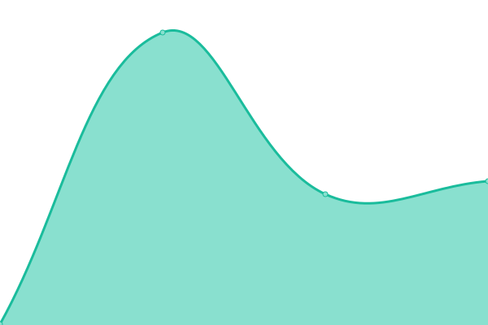

# [📈 Live Status](https://mvanschellebeeck.github.io/unbiased-science-uptime): <!--live status--> **🟩 All systems operational**

[**Visit our status website →**](https://mvanschellebeeck.github.io/unbiased-science-uptime)

This repository contains the open-source uptime monitor and status page for [Unbiased Science Sources](https://mvanschellebeeck.github.io/unbiased-science-uptime), powered by [Upptime](https://github.com/upptime/upptime).

<!--start: status pages-->
<!-- This summary is generated by Upptime (https://github.com/upptime/upptime) -->
<!-- Do not edit this manually, your changes will be overwritten -->
<!-- prettier-ignore -->
| URL | Status | History | Response Time | Uptime |
| --- | ------ | ------- | ------------- | ------ |
|  [Unbiased Science Sources](https://uspodsources.com) | 🟩 Up | [unbiased-science-sources.yml](https://github.com/mvanschellebeeck/unbiased-science-uptime/commits/HEAD/history/unbiased-science-sources.yml) | 

 238ms
     
 | 

<a href="https://mvanschellebeeck.github.io/unbiased-science-uptime/history/unbiased-science-sources">100.00%</a>
    

<!--end: status pages-->

## 📄 License

- Powered by: [Upptime](https://github.com/upptime/upptime)
- Code: [MIT](./LICENSE) © [mvanschellebeeck](https://mvanschellebeeck.github.io/unbiased-science-uptime)
- Data in the `./history` directory: [Open Database License](https://opendatacommons.org/licenses/odbl/1-0/)
